---
## Front matter
title: "Лабораторная работа №6"
subtitle: "Архитектура вычислительных систем"
author: "Зеленко Ирина Юрьевна"

## Generic otions
lang: ru-RU
toc-title: "Содержание"

## Bibliography
bibliography: bib/cite.bib
csl: pandoc/csl/gost-r-7-0-5-2008-numeric.csl

## Pdf output format
toc: true # Table of contents
toc-depth: 2
lof: true # List of figures
lot: true # List of tables
fontsize: 12pt
linestretch: 1.5
papersize: a4
documentclass: scrreprt
## I18n polyglossia
polyglossia-lang:
  name: russian
  options:
	- spelling=modern
	- babelshorthands=true
polyglossia-otherlangs:
  name: english
## I18n babel
babel-lang: russian
babel-otherlangs: english
## Fonts
mainfont: PT Serif
romanfont: PT Serif
sansfont: PT Sans
monofont: PT Mono
mainfontoptions: Ligatures=TeX
romanfontoptions: Ligatures=TeX
sansfontoptions: Ligatures=TeX,Scale=MatchLowercase
monofontoptions: Scale=MatchLowercase,Scale=0.9
## Biblatex
biblatex: true
biblio-style: "gost-numeric"
biblatexoptions:
  - parentracker=true
  - backend=biber
  - hyperref=auto
  - language=auto
  - autolang=other*
  - citestyle=gost-numeric
## Pandoc-crossref LaTeX customization
figureTitle: "Рис."
tableTitle: "Таблица"
listingTitle: "Листинг"
lofTitle: "Список иллюстраций"
lotTitle: "Список таблиц"
lolTitle: "Листинги"
## Misc options
indent: true
header-includes:
  - \usepackage{indentfirst}
  - \usepackage{float} # keep figures where there are in the text
  - \floatplacement{figure}{H} # keep figures where there are in the text
---

# Цель работы

Освоить арифметические инструкций языка ассемблера NASM.

# Задание

Написать программу вычисления выражения. Программа должна выводить выражение для вычисления, выводить запрос на ввод значения x, вычислять заданное выражение в зависимости от введенного x, выводить результат вычислений. Вид функции выбрать из таблицы 6.3 вариантов заданий в соответствии с номером полученным при выполнении лабораторной работы. Создайть исполняемый файл и проверить его работу для значений из 6.3.

# Теоретическое введение

1. Адресация в NASM
Существует три основных способа адресации:
• Регистровая адресация – операнды хранятся в регистрах и в команде используются имена этих регистров, например: mov ax,bx.
• Непосредственная адресация – значение операнда задается непосредственно в команде, Например: mov ax,2.
• Адресация памяти – операнд задает адрес в памяти. В команде указывается символическое обозначение ячейки памяти, над содержимым которой требуется выполнить операцию.
2. Арифметические операции в NASM
Схема команды целочисленного сложения add (от англ. addition - добавление) выполняет сложение двух операндов и записывает результат по адресу первого операнда. Команда add работает как с числами со знаком, так и без знака.
3. Целочисленное вычитание sub
Команда целочисленного вычитания sub (от англ. subtraction – вычитание) работает аналогично команде add.
4. Команды инкремента и декремента
Довольно часто при написании программ встречается операция прибавления или вычитания единицы. Прибавление единицы называется инкрементом, а вычитание — декрементом. Для этих операций существуют специальные команды: inc (от англ. increment) и dec (от англ. decrement), которые увеличивают и уменьшают на 1 свой операнд.
5. Команда изменения знака операнда neg
Команда рассматривает свой операнд как число со знаком и меняет знак операнда на противоположный. Операндом может быть регистр или ячейка памяти любого размера.
6. Команды умножения mul и imul
Умножение и деление, в отличии от сложения и вычитания, для знаковых и беззнаковых чисел производиться по-разному, поэтому существуют различные команды.
Для беззнакового умножения используется команда mul (от англ. multiply – умножение).
Для знакового умножения используется команда imul.
7. Команды деления div и idiv
Для деления, как и для умножения, существует 2 команды div (от англ. divide -
деление) и idiv. 
Для беззнакового умножения используется команда div.
Для знакового умножения используется команда idiv.

# Выполнение лабораторной работы

1. Создаём каталог для программам лабораторной работы No 7, перейдём в
него и создаём файл lab6-1.asm

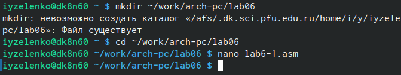{ #fig:001 width=90% }

2. Введем в файл lab6-1.asm текст программы из листинга 6.1.

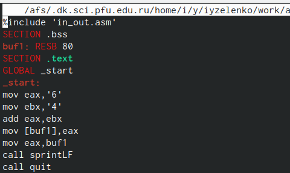{ #fig:002 width=90% }

3. Создаём копию файла in_out.asm в каталоге.

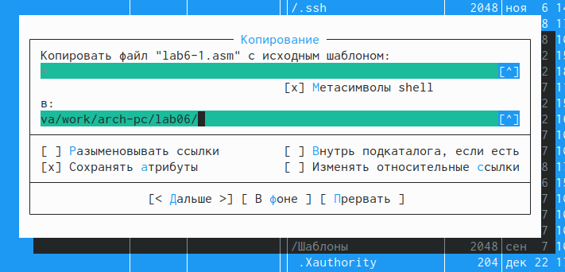{ #fig:003 width=90% }

4. Создадим исполняемый файл и запустим его.

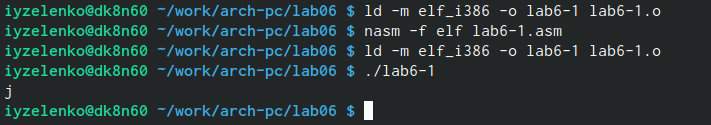{ #fig:004 width=90% }

5. Далее изменим текст программы и вместо символов, запишем в регистры числа. Исправим текст программы.

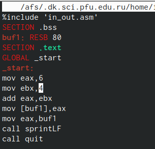{ #fig:005 width=90% }

6. Создадим исполняемый файл и запустим его (6-1).

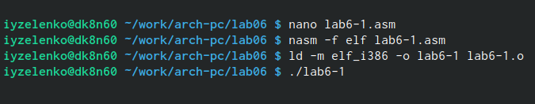{ #fig:006 width=90% }

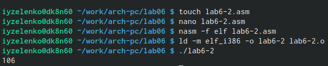{ #fig:007 width=90% }

7. Создадим файл lab6-2.asm в каталоге. Введем в него текст программы из листинга 6.2 и запустим его.

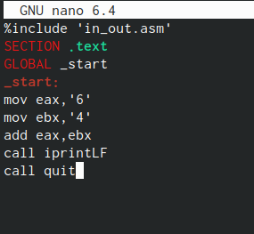{ #fig:008 width=90% }

8. Изменим символы на числа в lab6-2. Создадим исполняемый файл и запустим его. 

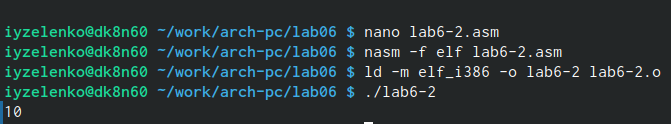{ #fig:009 width=90% }

9. Создадим файл lab6-3.asm в каталоге. Введем в файл lab6-3.asm текст программы из листинга 6.3

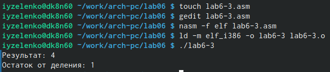{ #fig:010 width=90% }

10. Введем в файл lab6-3 программу вычисления выражения .

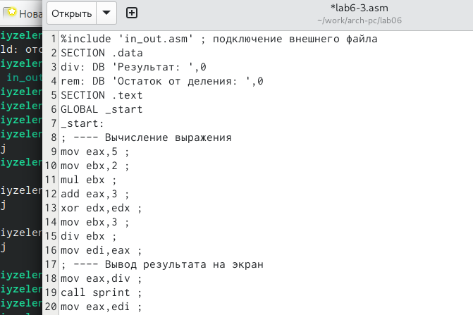{ #fig:012 width=90% }

11. Создадим исполняемый файл и запустим его для вычисления выражения.

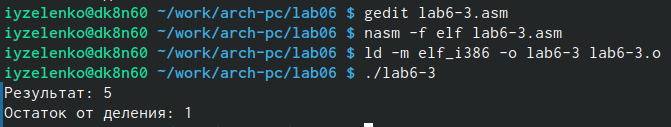{ #fig:013 width=90% }

# Ответы на вопросы:

1. строки листинга 7.4 отвечают за вывод на экран сообщения ‘Ваш
вариант: mov eax и rem call sprint;
2. mov ecx,x - запись входной переменной в регистр ecx;
   mov edx, 80 - запись размера переменной в регистр edx;
   call sread - вызов процедуры чтения данных;
3. call atoi -  функция преобразующая ASCII код символа в целое число и записывающая результат в регистр eax;
4. xor edx, edx mov ebx, 20 div ebx, inc edx; 
5. div ebx - ebx;
6. inc - используется для увеличения операнда на единицу;
7. Следующие строки листинга отвечают за вывод на экран результата вычис-
лений mov eax, rem call sprint mov eax, edx call iprintLF. 

# Выводы

В ходе выполнения данной лабораторной работы я освоила арифметические инструкции языка ассемблера NASM.

# Список литературы{.unnumbered}

::: {#refs}
:::
